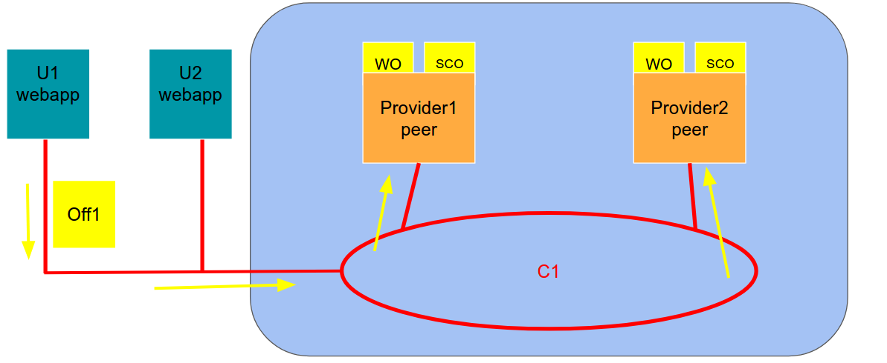
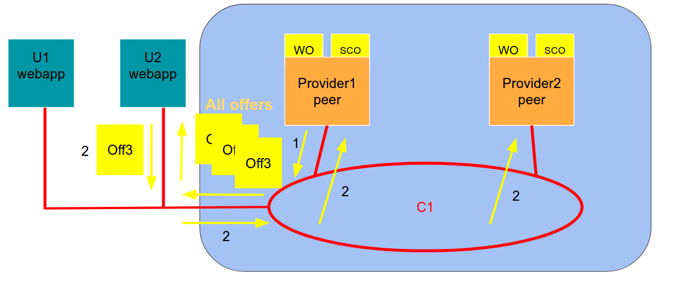

#Design

SP = Service Provider
U = User

## Summary of the requirements

The idea is to create an hyperledger network between multiple service provider that offer different type of services (e.g video streaming, hosting, vpn access ...)

This network will allow users to rent to other users their access to services and gain in return HyperCash (HC).
Then they will be able to rent access to other services belonging to the network using the gained currency. So this technology will basically allow the creation of a marketplace of access to services between users.
Users will not be able to convert HyperCash into real money.

## Network design
The network is composed by one application channel on which are deployed three chaincodes (one related to subscriptions, one related to money and one which controls the rent offers). Each service provider will have a peer which executes the three smart contracts (SCS, SCM and SCO respectively) and keeps an updated version of the three world states (WS, WM and WO). The endorsement policies are different based on the type of the transaction. Each provider will have also 1 ordering nodes, and they will reach consensus through Raft.
The user will connect to the network through a web app which is stored in the customer device. There he can check the state of its own wallet, issue a new offer, read the offer world state or rent a subscription.

Example network with 2 SP and 2 users:

Example of insertion of subscription by the user:

When a user subscribes to a new service, if it chooses to share the subscription within the network, the Service Provider will issue the new subscription to the channel.
All the other peer in the network will add it to their ledger, if the data is valid.

Example of insertion of offer by the user:

When a user wants to add an offer to the ledger it requests a write to the ledger, if the offer is legitimate the service providers approves it and adds it to LO (Ledger of Offers).

Example of accept of offer by the user:

When a user wants to accept an offer from the ledger, it queries the offers smart contract and gets all the offers. Then it decides which one he wants and he sends on the channel for the provider to update the state.
## Application Design

### Service provider side

- Register to the network page
The service provider will have to implement a register to the network page where users can generate their couple (sk,pk) and get a certificate that identifies them into the blockchain network.

- Link account page
This page will allow users to publish their ownership of a "normal" account of a Service Provider to the blockchain network, linking it to their public key. The user will have to send a signature to prove that he own the sk related to his pk. The SP will have to modify his internal database in order to link the "normal" account to the Hyperledger certificate.

- Login with Hyperledger to access the Service
This will be an additional button (Like "login with google") that the user will be able to use in order to use his certificate to identify himself and login to the service. The provider will check on the blockchain if the user really has access to the service at this moment in time.

### Client side (webapp)

- Webapp local to client to login to the network itself and see the offers. (gateway)
This webapp will also contain the wallet for the client (the certificate)

## Chaincode design
- subscription world state

It is used to keep track of the owner of a certain subscription for a determined period of time. The update of the world state happens when a User subscribes to a new service outside the network or when a user rents an existing subscription for a fixed time. In the second case the SP will update the ledger removing the time slot from the previous user and adding it to the new one.
The endorsement policy for this Smart Contract should require that the transaction is signed by the provider of the service itself in case of a new subscription.
The methods that needs to be implemented are: new subscription, split subscription, query.

UserId | Provider | SubscriptionId|Duration
---- | ---- | ---- | ---- | ---- |
A|Netflick|001|{0: {01/01/2020 00.00,31/12/2020 12.59}, 1: {...,...}}

- money world state

It will represent the state of the wallet of each user inside the blockchain.
The endorsement policy will require that at least the majority of the SP share the same result and sign it.
The function that need to be implemented are: addiction, subtraction and query

UserId | amountOfMoney |
---- | ---- |
A|100|

- offers world state

It is the collection of all the offers. The user can trigger a request to add a new offer inside the ledger. When a second user decides to accept this offer the SCO (Offers Smart Contract) has to trigger a change the other 2 chaincodes in order to keep updated the wallets of the two users and the owner of the subscription.
The endorsement policy requires that the majority of the SPs agree on the transaction. This prevent that a single service provider stops a user from making rent requests, as this would allow the SP to benefit from the network, without actually providing the service. Moreover it also allows consistency because when the transaction is approved it will also modify the subscription world state and prevent a user from renting the same slot time twice. On the other hand other service providers will not have any interest to validate fake request from the moment that it will result in a bigger contribution to the blockchain from the victim service provider. This is why we think a majority vote is enough for this type of transaction.
methods: publish,accept,query

UserId | Provider | SubscriptionId|startTime|endTime | price
---- | ---- | ---- | ---- | ---- | ----
A|Netflick|001|07/07/2020 13.00 |07/07/2020 14.00 | 50 HC

## Improvements
- enable cross device auth (crypted key on sp solution)
- make only necessary data public
- bidding system
- signing of offer from user
- common payments with ethereum?
