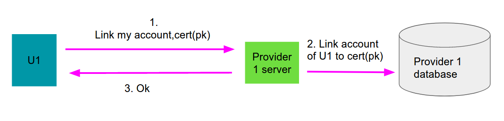
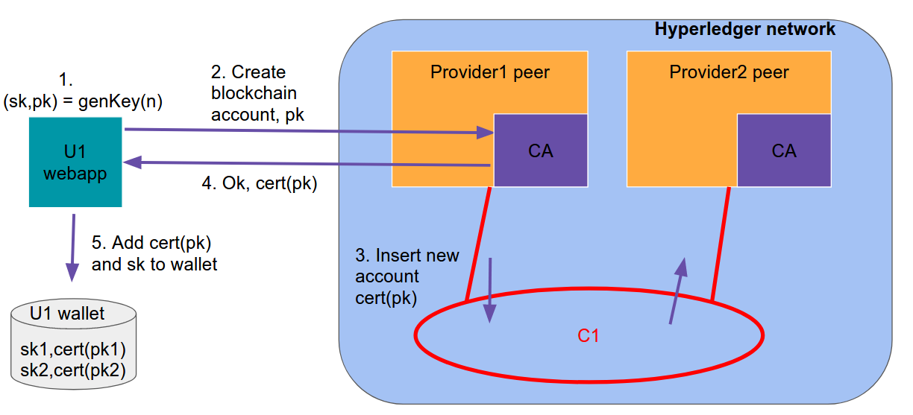

# Design

## Summary of the requirements

The idea is to create an hyperledger network between multiple service provider that offer different type of services (e.g video streaming, hosting, vpn access ...)

This network will allow users to rent to other users their access to services and gain in return HyperCash (HC).
Then they will be able to rent access to other services belonging to the network using the gained currency. So this technology will basically allow the creation of a marketplace of access to services between users.
Users will not be able to convert HyperCash into real money.

## Network design

#### Parties involved
- Service providers, which contains
    - server with related database that allows access of the service to the client.
    - hyperledger peer.
    - hyperledger ordering node.
    - CA for the certificate required by organization to identify itself

- End users
    - they will use the WebApp to interact to the hyperledger blockchain.

- External CA, which will use a threshold signature between all the organization to create the user certificate
- Common payment account, external to the Hyperledger blockchain.

The network is composed by one application channel on which are deployed three chaincodes (one related to subscriptions, one related to money and one which controls the rent offers). Each service provider will have a peer which executes the three smart contracts (SCS, SCM and SCO respectively) and keeps an updated version of the three world states (WS, WM and WO). The endorsement policies and the access control are different based on the type of the transaction. Each provider will also have 1 ordering node, and they will reach consensus through Raft.
During the registration of a user, a service provider will start the threshold signing mechanism with the other organization and send back the certificate to the user.
The user will connect to the network through a web app which is stored in the customer device. Therefore he will be able to check the state of its own wallet, issue a new offer, read the offer world state or rent a subscription.

Example network with 2 SP and 2 users:

## Application Design

### Service provider side

- Link account page
This page will allow users to link their "normal account" to the blockchain one. The user will have to send a signature to prove that he own the sk related to his pk. The SP will have to modify his internal database in order to link the "normal" account to the user identifier.

- Issue subscription

When a user subscribes to a new service, if it chooses to share the subscription (Sub1) within the network, the Service Provider will issue the new subscription to the channel.
All the other peer in the network will add it to their ledger, if the data is valid.

- Login with Hyperledger to access the Service
This will be an additional button (Like "login with google") that the user will be able to use in order to use his certificate to identify himself and login to the service. The provider will check on the blockchain if the user really has access to the specific service at this moment in time.

### Client side (webapp)

The client side webapp will handle the wallet of the user and provide a graphical interface in order to connect to the blockchain and perform the operation specified below.
The application will also handle the payments to the blockchain.
Operations:

- register to the network

When a new user register via the webapp it creates the key pair (sk,pk), connect to the CA of the network, and get a certificate that identifies them into the blockchain network.

- insert a new offer

When a user wants to add an offer (Off1) to the ledger it requests a write to the ledger, if the offer is legitimate the service providers approves it and adds it to LO (Ledger of Offers).

- retrieve all offers & eventually accept an offer

The process of accepting an offer from the ledger consists in 2 phases:
1. the user queries the offers smart contract and gets all the offers (Off1,Off2,Off3).
2. the user decides which one he wants (Off3) and he sends it on the channel so that the providers can update the state.

## Chaincode design
#### subscription world state

It is used to keep track of the owner of a certain subscription for a determined period of time. The update of the world state happens when a User subscribes to a new service outside the network or when a user rents an existing subscription for a fixed time. In the second case the SP will update the ledger removing the time slot from the previous user and adding it to the new one.
The transaction validation, which is common for all the functionality of the Smart Contract, should be majority, and it is guaranteed by the endorsement policy. The access control, on the other hand, is different based on the transaction we are trying to perform. Therefore, it will be implemented at a function level.
The methods that needs to be implemented are: new subscription, split subscription, query.

UserId | Provider | SubscriptionId | Duration
---- | ---- | ---- | ----
A | Provider 1 | 001 | [0: [01/01/2020 00.00,31/12/2020 12.59], 1: [...,...]]

#### money world state

It will represent the state of the wallet of each user inside the blockchain.
The endorsement policy will require that at least the majority of the SP share the same result and sign it, while the access control will depend from each function.
The function that need to be implemented are: addiction, subtraction,query, verifyPayment and newAccount

UserId | amountOfMoney | LastPaymentDate
---- | ---- | ---- |
A|100| 03/09/2020 |

#### offers world state

It is the collection of all the offers. The user can trigger a request to add a new offer inside the ledger. When a second user decides to accept this offer the SCO (Offers Smart Contract) has to trigger a change in the other 2 chaincodes in order to keep updated the wallets of the two users and the owner of the subscription.
The endorsement policy requires that the majority of the SPs agree on the transaction. This prevent that a single service provider stops a user from making rent requests, as this would allow the SP to benefit from the network, without actually providing the service. Moreover it also allows consistency because when the transaction is approved it will also modify the subscription world state and prevent a user from renting the same slot time twice. On the other hand, other service providers will not have any interest to validate fake request from the moment that it will result in a bigger contribution to the blockchain from the victim service provider. This is why we think a majority vote is enough for this type of transaction.
The function that need to be implemented are: publishOffer, acceptOffer, query and removeOffer

UserId | Provider | SubscriptionId|startTime|endTime | price
---- | ---- | ---- | ---- | ---- | ----
A|Provider 1|001|07/07/2020 13.00 |07/07/2020 14.00 | 50 HC

### Interactions between smart contracts

- login with hyperledger functionality

- Insert new subscription

- Register to the network

- Proof of payment

- Publish an offer

- Accept an offer

- Remove an offer

## Economic returns
The use of the network will require the payment of a monthly fee for all the users. Moreover, each user can buy extra coins to rent subscriptions using real money.  Therefore, to prevent an excess of coin in the network, which would prevent the user from buying new ones, at each transaction is applied a tax.

All the money collected by the previous means will be distributed to all the organization that participate to the network. The split could be equal for each company or could be based on the contribution of the service provider in the network (how many subscription are rented).

#### Common payment design

There will be a common payment account (bank account or ethereum account) where users will deposit their money when paying to the network.
In order to claim the assets the client will invoke a transaction where he will provide a proof of payment. The peers will verify that the payment has been actually performed and will grant the assets on the blockchain.

## Future implementation
The following aspects of the project were not implemented for a lack of time.
- Client webapp
- Fees mechanism on transaction
- enable cross device auth (crypted key on sp solution)
- improve privacy aspect
- bidding system
